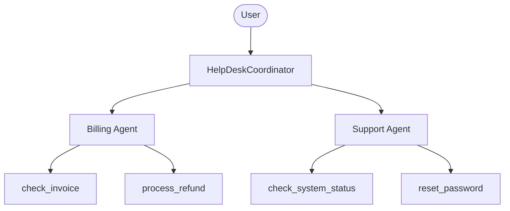

# Basic Agent with LM Studio (Local Models)

A multi-agent HelpDesk system using [LM Studio](https://lmstudio.ai/) for local model inference.

## Architecture



## Prerequisites

1. **Download LM Studio:** https://lmstudio.ai
2. **Download a model** in LM Studio (recommended: Llama 3.2, Mistral, Qwen)
3. **Start the local server** in LM Studio:
   - Go to the "Local Server" tab
   - Load your preferred model
   - Click "Start Server" (default port: 1234)

## Setup

1. (Optional) Copy the environment file to change the default URL:
   ```bash
   cp .env.example .env
   # Edit .env if using a different port
   ```

2. Install dependencies:
   ```bash
   bun install
   ```

3. Run the agent with DevTools:
   ```bash
   bun run web
   ```

## Recommended Models

For best results with function calling, use models that support tool use:

- **Llama 3.2** (3B or 8B) - Good balance of speed and capability
- **Mistral 7B Instruct** - Fast and capable
- **Qwen 2.5** - Excellent for tool use

## Troubleshooting

### "Connection refused" error

Make sure LM Studio's local server is running:

1. Open LM Studio
2. Go to "Local Server" tab
3. Load a model
4. Click "Start Server"

### Slow responses

Local models depend on your hardware:

- Use smaller models (3B-7B) for faster responses
- Enable GPU acceleration in LM Studio settings
- Consider using quantized models (Q4, Q5)

## Example Questions

### Billing Agent
- "Can you check the status of invoice INV-001?"
- "I need to request a refund for invoice INV-002"
- "What invoices do I have for user@example.com?"

### Support Agent
- "What's the current status of the auth service?"
- "I need to reset my password for user@example.com"
- "Is the API experiencing any issues?"

### Coordinator
- "I have a billing question about my subscription"
- "I can't log into my account"
