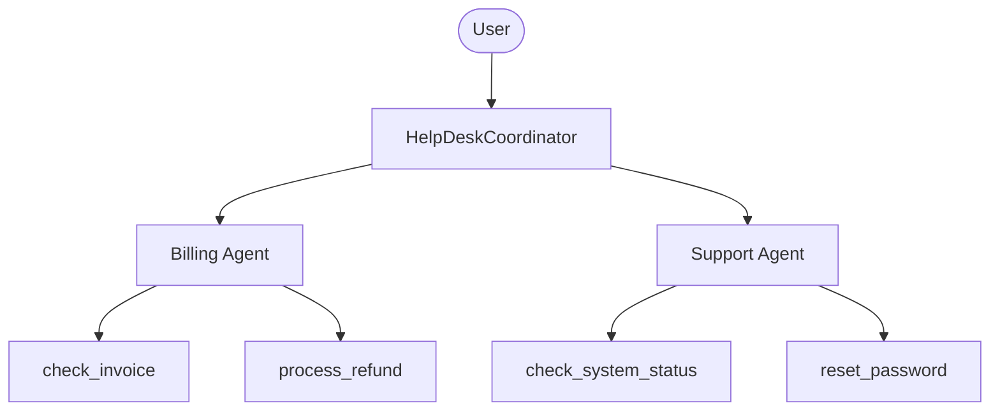

# Basic Agent with OpenAI

A multi-agent HelpDesk system using [OpenAI](https://openai.com/) as the LLM provider.

## Architecture



## Setup

1. Copy the environment file and add your OpenAI API key:
   ```bash
   cp .env.example .env
   # Edit .env and add your OPENAI_API_KEY
   ```

2. Install dependencies:
   ```bash
   bun install
   ```

3. Run the agent with DevTools:
   ```bash
   bun run web
   ```

## Supported Models

- `gpt-4.1` (default)
- `gpt-4o`
- `gpt-4o-mini`
- `o1`, `o3`
- `chatgpt-4o-latest`

To change the model, edit `agent.ts` and update the `model` property.

## Example Questions

### Billing Agent
- "Can you check the status of invoice INV-001?"
- "I need to request a refund for invoice INV-002"
- "What invoices do I have for user@example.com?"

### Support Agent
- "What's the current status of the auth service?"
- "I need to reset my password for user@example.com"
- "Is the API experiencing any issues?"

### Coordinator
- "I have a billing question about my subscription"
- "I can't log into my account"
